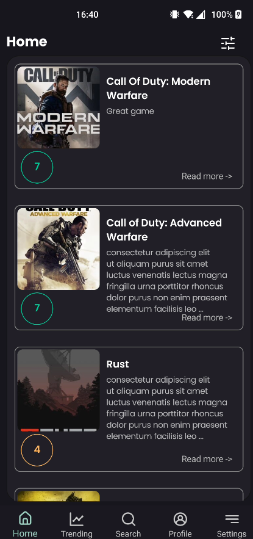
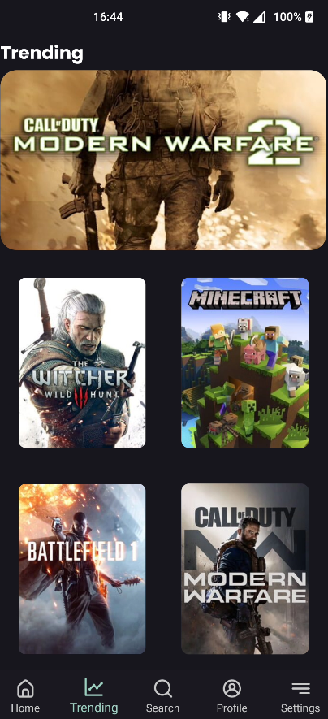
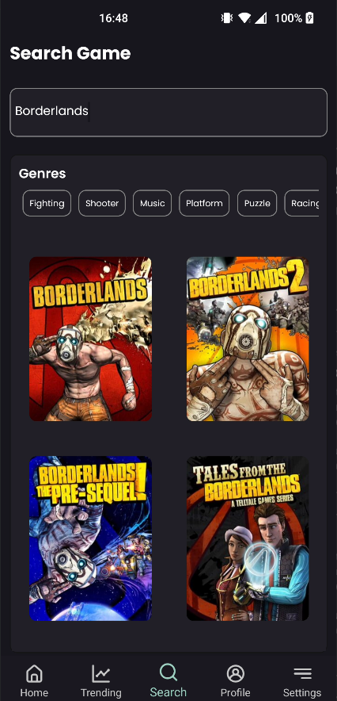
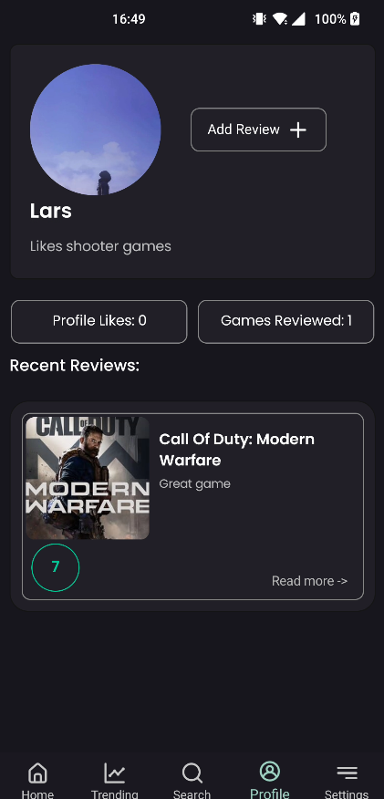
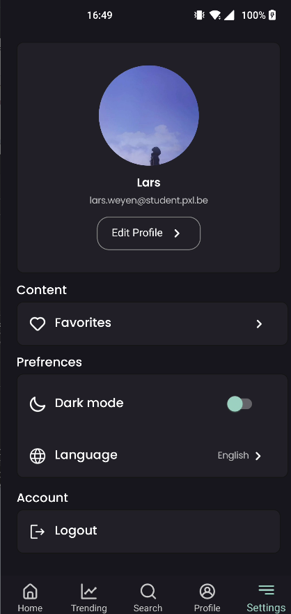
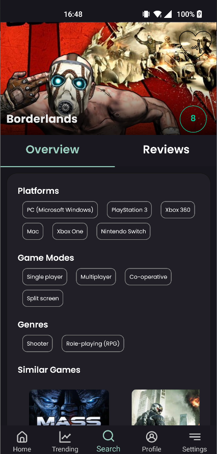
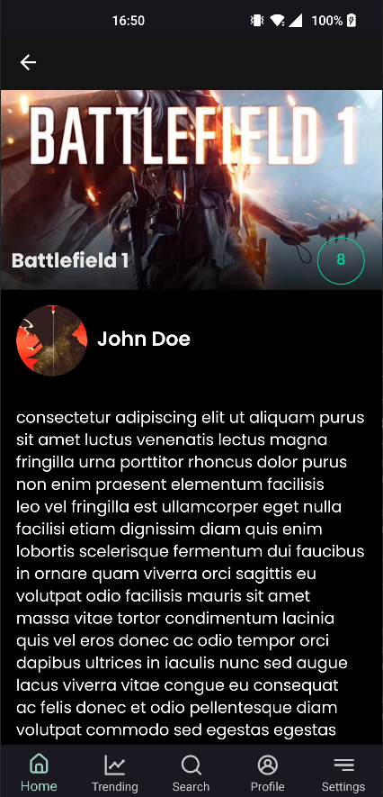

# Project C# Mobile 2022-2023

Naam en email: **Lars Weyen - Lars.Weyen@student.pxl.be**

Titel applicatie: **Recensio**

Een app waarmee je zelf reviews kunt schrijven voor games of bekijken om zo te weten of een game goed is of niet.
Gebruikers kunnen ook een score geven bij hun review. De Homepage bevat recente reviews, Trending bevat de meest
gereviewde games rond die tijd en dan is er ook nog een search functie waarmee je zelf een game opzoekt, elke game
pagina bevat info over het spel, de rating van het spel, en de reviews. Gebruikers hebben ook een profiel waar ze hun
reviews op terug vinden en andere gebruikers kunnen dat profiel Liken.

Opsomming belangrijkste kenmerken en onderdelen/features van de applicatie:

* *Inloggen/Registeren*
* *Profiel foto kiezen*
* *Review bekijken*
* *Games opzoeken*
* *Games reviewen*
* *Reviews filteren*
* *Settings Aanpassen*
* *Profiel liken van een andere user*

# Logboek

* *22/10/2022: Aanmaken van project en proberen verbinding te maken met mijn API*
* *23/10/2022: Start, registreer en login scherm maken - Zorgen dat de gebruiker kan registreren en inloggen*
* *04/11/2022: Research doen om te kijken welke API calls ik moet maken naar de IGDB Game database API*
* *10/11/2022: Profiel van gebruiker stylen, review toevoegen pagina gemaakt*
* *11/11/2022: Tabbar toegevoegd, Search pagina, Profiel functies: toont aantal likes, aantal reviews en de reviews zelf
  dat de gebruiker heeft. Reviews kunnen toegevoegd worden*
* *12/11/2022: Er voor gezorgt dat de GameView pagina een overzicht met informatie en de reviews van de game bevat*
* *20/11/2022: Trendingview aangemaakt, Clickable genres zodat je alleen games ziet met die genre, Homepage toont recent
  reviews*
* *27/11/2022: Settings view waar je uw Profiel foto, username, ... kan aanpassen*
* *28/11/2022: Preference view gemaakt waar je darkmode kan aan- uitzetten, uitloggen, favorieten games, taal kiezen.*
* *03/12/2022: Ervoor gezorgt dat je games als favorieten kan toevoegen*
* *04/12/2022: Favorites view gemaakt waar je uw favoriete games kan bekijken*
* *06/12/2022: Popup gemaakt op de homepagina waardoor je kan sorteren op verschillende opties*
* *31/12/2022: Ervoor gezorgt dat als je op een review drukt de volledige review kan bekijken*
* *1/01/2023: Trending pagina laat meest gereviewde games zien, carousel veranderd om de 5 seconden*
* *2/01/2023: Converters toegevoegd die de kleuren van de rating aanpassen*
* *3/01/2023: Functie om mensen hun profiel te liken toegevoegd en een paar stylings*
* *5/01/2023: Converter toegevoegd dat de review beschrijving verkort op de homepagina en een behavior op de password
  entry*
* *10/01/2023: Finishing touches, bugfixing, video maken*

# Optioneel: Screenshots

# Videolink

*https://web.microsoftstream.com/video/d8a15369-df8e-41bc-a9c6-2c2c84034b99*

# Bronnen

* *https://learn.microsoft.com/en-us/dotnet/maui/user-interface/controls/shapes/?view=net-maui-7.0 - Heart shape
  icoontje*
* *https://youtu.be/dWnGoZY3XiE - Login Flow*
* *https://www.youtube.com/watch?v=0-FaDeCPIhM - Popup tutorial*
* *https://www.syncfusion.com/blogs/post/dotnet-maui-combobox-control.aspx - Combobox*
* *Powerpoint Week 6 deel 1 - Behaviors*
* *https://youtu.be/k7m9KzKutjw - Converters*
* *https://de.freepik.com/vektoren-kostenlos/niedlich-affe-gamer-spielender-spiel-karikatur-vektor-symbol-abbildung-tier-technologie-symbol-isolated_29084475.htm#query=gamepad&position=36&from_view=keyword
  - App icoontje*

# Future work

*Wat zou je nog aanpassen/verbeteren mocht je meer tijd hebben? Hoe zou je dit aanpakken?* 
